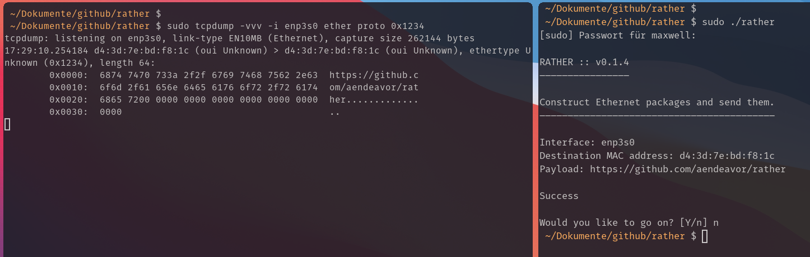

# Using Rust on RAw sockets to create eTHERnet frames

This binary crate implements similar behavior as [Scapy](https://scapy.net/) does for Ethernet Frames, but implemented in Rust using Linux's Raw Sockets.

## If You Do Not Have Rust Installed

1. Shame on you
2. You can grab it via `curl --proto '=https' --tlsv1.2 -sSf https://sh.rustup.rs | sh`

This will come in handy if you'd like to alter the application or view the full documentation.

## Usage



The binary is written in Rust. You can either execute the binary in the root of this directory directly with `./rather` or use `cargo run` to compile and run it yourself.

If you compile if with Cargo, you can choose whether to enable or disable the debug traces from the C files. You will just need to comment / uncomment

``` C
internal_debug(&socket_adress, frame);
```

in `components/binding.c`.

**Note**: You will need to have at least two interfaces running, as `rather` assumes the `lo` interface is at index 1 and a secondary interface (which `rather` chooses) at interface 2.

## Documentation

The full documentation can be opened with `cargo doc --open`.

### Inner Workings

These are best described when looking at the code and documentation directly. There is not that much code, and it is absolutely self-descriptive. We are building some C files too, namely `componenst/binding.c` and `components/debug.c`.

A brief description of the program workflow:

``` BASH
START ::
    OPENING THE RAW SOCKET  -> (exiting with 1 if unsuccessful)
    CREATING DEFAULTS -> (exiting with 1 if no two interfaces exist)
    HANDLING USER INPUT
    BUILDING THE ETHERNET FRAME ::
        USING THE INFORMATION TO PROVIDE THE FRAME STRUCTURE
        SERIALIZING THE FRAME STRUCTURE INTO AN ARRAY
    SENDING THE FRAME ::
        CALLING A WRAPPER FUNCTION
        WRAPPER CALLS INTO C CODE
        CHECKING THE OUTCOME
    USER INPUT - PROCEED?
:: FINISH
```
